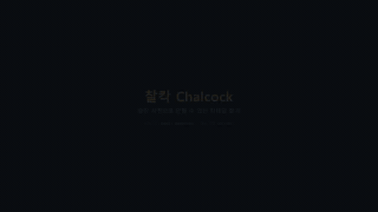

# Bottle detection for cocktail recommendation



Detects liquor bottles in a photo of a home bar shelf, so the set of detected bottles can be
matched against a cocktail database to recommend drinks that are actually makeable. The web
demo (`app/`) runs this end to end: upload a photo, get back the bottles it found and the IBA
cocktails they make. The clip above is `yolo11s_v10/epoch80` at conf 0.4, one-stage, running on
real (not staged) shelf photos — generate a fresh one with `python scripts/make_demo_video.py`.

This repository holds the detector: the dataset merge and the YOLO training.

## The dataset

`ouo_final/` is the working collection: 122 brand folders under 21 spirit categories, laid out
`category/brand/<image>.jpg` + `<image>.txt` with a `classes.txt` beside them. It is **not
tracked** — 828 MB against a repo already near 700 MB, and its provenance is the same unresolved
2023 collection described below. `scripts/build_dataset_ouo.py` rebuilds `dataset_v2/` from it.

| | old `dataset/` | merged `dataset_v2/` |
| --- | --- | --- |
| photos | 1,494 | **3,417** |
| boxes | 1,593 | **13,080** |
| classes | 50 | **119** |

Merging the two is mostly deduplication. MD5 finds **zero** overlap, because the old set came
through Roboflow's re-encoding while ouo_final holds the originals; pHash finds that **93% of the
old images are already there**. The old set contributes 172 genuinely new photos, and they are
kept because they still carry annotation work.

Four things the layout needed handling for:

1. **`classes.txt` is per folder and there are three different ones** (113, 5 and 5 names), so the
   same label id means different bottles in different folders and the mapping has to be read
   locally rather than globally.
2. **34 `.txt` files are JPEGs** saved with the wrong extension, plus empty labels and 122 images
   with no label at all — all skipped.
3. **`calvados/1`** has a folder and a class both literally named `1`; numeric class names fall
   back to the category.
4. **Spelling drift between the two sets.** `camusvsop` against `camus_vsop` would have become two
   classes for one bottle. Ignoring punctuation lines up 47 of the old 50; three needed a human:
   `grandmanier` → `grandmarnier` (the old export's typo), `orangebitters` → `orange`,
   `wildturkeykrye` → `wildturkey`.

Splitting also needed care: a class with 7 boxes can land entirely in validation, leaving nothing
to train on, so train and valid each take one photo of every class before the fractions apply.
`calvados` exists in a single source photo and so appears only in train.

The 21 category folders are a free gift — they say what each brand pours, so
`dataset_v2/class_ingredients.yaml` is generated rather than hand-written. The old 50-class
mapping in `data/bottles.yaml` was typed by hand; the 119-class one is not.

Two practical notes. ouo_final holds camera originals up to 3024x4032 where the old set was
uniformly 640x640, so `--max-side` caps the long edge at 1280 on copy (training resizes to 640
regardless) and `--cache` is off by default: caching 8 GB of decoded originals overflows
ultralytics' 32-bit offset buffer and fails with "negative dimensions are not allowed".

## The dataset problem the first merge fixed


`finalloopy/` contains **50 separate Roboflow exports, one per bottle**. Each was annotated on
its own, which means a single shelf photo showing three bottles was uploaded to three different
projects, and in each copy only *that* project's bottle carries a box:

| copy | file lives in | boxes it has |
| --- | --- | --- |
| A | `gordons/train/` | `gordons` only |
| B | `wyborowa/train/` | `wyborowa` only |
| C | `plantationoriginaldark/train/` | `plantationoriginaldark` only |

Training on that as-is is actively harmful — every copy teaches the model that the other two
bottles are background. `scripts/build_dataset.py` merges the exports into one 50-class dataset:

1. **Class ids are remapped from the folder name**, not from `data.yaml`. Several exports name
   their class with a bare number (`'56'`, `'61'`), so the yaml names are unusable. The one
   genuine multi-class export (`camusxo`, `nc: 2`) is resolved through its yaml names.
2. **The same photo is recognised across folders** by MD5 for byte-identical copies, plus a
   perceptual hash (distance ≤ 2, same resolution) for copies that Roboflow re-encoded — those
   have different bytes *and* different filenames, so neither alone is enough.
3. **Boxes are unioned** per photo, dropping duplicates of the same class above IoU 0.6.
4. **One split per photo.** When copies disagreed (one export put it in `train`, another in
   `valid`) the split is decided by majority, tie broken toward `train`. Without this the merged
   set would leak training images into validation.

Result: **1547 source files → 1494 unique photos, 1593 boxes, 50 classes**, of which 41 photos
carry boxes from more than one original folder.

```
train 1038 · valid 314 · test 142
```

## Recipes

`data/iba_cocktails.json` holds all **102 official IBA cocktails** (34 Unforgettables, 34
Contemporary Classics, 34 New Era Drinks) with exact measurements, method and garnish, scraped
from iba-world.com by `scripts/fetch_iba.py` rather than written from memory.

Getting from a detected bottle to a recipe takes two mappings:

- `data/bottles.yaml` — each of the 50 detector classes to what it pours (`gordons` → `gin`).
- `data/ingredient_rules.yaml` — the 225 different ways the IBA writes an ingredient
  ("Fresh Lime Juice", "Freshly Squeezed Lime juice", "Fresh lime") down to one canonical key,
  split into `bar` items that must be on the shelf and `pantry` items assumed present.
  `equivalents` are freely interchangeable (Cointreau for triple sec); `substitutes` are only
  accepted under `--loose` (aged rum where the IBA asks for white).

## Usage

```bash
# 1. merge the 50 exports into dataset/
python scripts/build_dataset.py --report   # inspect first, writes nothing
python scripts/build_dataset.py

# 2. train
python scripts/train.py                              # yolo11s, 200 epochs
python scripts/train.py --model yolo11m.pt --epochs 300

# 3. recommend
python scripts/recommend.py --image shelf.jpg          # two-stage by default
python scripts/recommend.py --image shelf.jpg --one-stage
python scripts/recommend.py --bottles gordons,extradry,maraschino,orangebitters
python scripts/recommend.py --bottles ... --loose --missing 1
python scripts/recommend.py --check        # audit the rules against the recipe data
```

`dataset/manifest.csv` records, for every merged photo, which source folders it came from and
which classes it ended up with.

### What the 50 bottles actually reach

All 50 classes together supply 28 distinct ingredients, which covers **23 of the 77** bar
ingredients the IBA list calls for — enough for **29 cocktails** exactly as specified, or 49
with `--loose`. The single biggest gap is that the shelf has aged, dark, spiced and coconut rum
but **no white rum**, which alone blocks the Daiquiri, Mojito, Cuba Libre and Piña Colada.
Campari (Negroni, Americano, Boulevardier, Cardinale) and Angostura bitters (Manhattan, Old
Fashioned) are the next two.

## Results, and why the headline number is misleading

YOLO11s, 640px, early-stopped at epoch 149 (best at 99):

| split | mAP50 | mAP50-95 |
| --- | --- | --- |
| valid | 0.991 | 0.986 |
| test | 0.952 | 0.940 |

Both splits come from the same 2023 photo sessions as the training images, so this measures
memorisation of those sessions, not detection of a bottle in the wild. Weakest test classes are
`extradry` (0.533), `gordons` (0.720) and the near-identical pairs the label set contains —
`johnbarrfinest`/`johnbarrreserve` (0.724/0.746), `camusvsop` (0.745).

Measured against the hand-annotated test set (27 photos, 255 boxes, of which **26 are bottles the
model was actually trained on** and 229 are not), the same weights give:

| conf | path | found | found + named right | naming accuracy | precision | false alarms on unknown |
| --- | --- | --- | --- | --- | --- | --- |
| 0.25 | direct | 2/26 (7.7%) | 2 (7.7%) | 100% | 40% | 0.9% |
| 0.25 | two-stage | 7/26 (26.9%) | 2 (7.7%) | 28.6% | 7.7% | 7.4% |
| 0.5 | direct | 2/26 (7.7%) | 2 (7.7%) | 100% | 66.7% | 0.4% |
| 0.5 | two-stage | 3/26 (11.5%) | 1 (3.8%) | 33.3% | 10% | 3.1% |
| 0.7 | two-stage | 1/26 (3.8%) | **0** | 0% | 0% | 0.4% |

Two things to take from this. **Real-world identification tops out at 2 of 26 bottles** against a
test mAP of 0.95. And **raising the threshold makes it worse, not safer** — by conf 0.7 nothing
correct survives, so the model's confidence is anti-correlated with being right and no operating
point trades recall for precision. Two-stage roughly quadruples localisation (7 vs 2) but naming
accuracy collapses from 100% to 28.6%, because the extra crops it feeds the model are the hard
ones, and the model guesses rather than abstaining.

Note the sample is small — 26 in-vocabulary bottles — so these rates carry wide intervals. They
are clear enough to act on and too thin to rank fixes by.

The cause of the localisation failure is scale:

| | training set | real shelf photos |
| --- | --- | --- |
| median box area (% of image) | 20.3% | 1.24% |
| 75th percentile | 26.8% | 2.69% |

Three quarters of real-world bottles are smaller than 95% of the training bottles. The model was
trained on close-ups and never sees a bottle at shelf scale.

`recommend.py --two-stage` works around this by detecting bottles with a COCO-pretrained model
and running the brand model on each crop, which puts the subject back at the trained scale.

The deeper problem is that there is no way to answer "none of these". Every crop is forced into
one of 50 classes, and the annotation confirms how badly that bites: **229 of the 255 annotated
bottles (90%) are outside the vocabulary**. The annotator could even name several of them —
Beefeater, Gilbey's Gin, Aperol, Jack Daniel's, Campari — which is a concrete shortlist of
classes worth adding, and a reminder that a real bar simply is not made of these 50 bottles.

Because the model cannot abstain, every one of those 229 is a chance to invent an ingredient,
and 7.4% of them take it at conf 0.25. That is what makes the recommender propose cocktails from
bottles that are not on the shelf.

## The 119-class model, and a threshold that is not comparable

Trained on `dataset_v2`: 200 epochs, early-stopped at 85, best at 35. Its own test split reads
mAP50 0.513 / mAP50-95 0.484 against the 50-class model's 0.952 / 0.940 — but those are different
test sets over different vocabularies, and the v2 split is the harder one: 119 classes, and
deduplication now spans both collections so near-duplicates no longer straddle train and test.

On the real-world set the first comparison looked like a collapse — 0 correct at conf 0.25 — and
that was a measurement error, not a result. **Confidence is not comparable across models with
different class counts.** 119 classes divide the softmax mass far more finely, so v2 operates
around 0.05 where v1 operates around 0.02–0.25. Swept properly, each at its own best point:

| model | conf | found | named right | naming accuracy | false alarms |
| --- | --- | --- | --- | --- | --- |
| 50-class | 0.02 | 14/26 | **10/26 (38.5%)** | **71.4%** | 22.7% |
| 50-class | 0.15 | 8/26 | 6/26 (23.1%) | 75.0% | 11.4% |
| 119-class | 0.05 | 14/28 | 6/28 (21.4%) | 42.9% | 18.5% |

The 50-class model still names better. Two things qualify that:

- **The test set is labelled to the 50-class vocabulary**, so 69 of v2's classes cannot be
  credited even when right, and a correct naming of, say, a Ballantine's counts as a false alarm
  because the annotation says `unknown_bottle`. The comparison is structurally unfair to v2 and
  cannot be fixed without re-annotating.
- **Coverage is where v2 wins outright.** Its classes supply **43 of the 77** bar ingredients the
  IBA list calls for, against 23 for the 50-class set. White rum, Campari, Aperol, Chartreuse,
  absinthe and Bénédictine all enter the vocabulary — so Daiquiri, Mojito and Cuba Libre, the
  three the README used to list as blocked, now actually appear in the demo.

The app loads either and picks the threshold to match: 0.25 at or below 60 classes, 0.05 above.
A fixed 0.25 on the 119-class model returns nothing at all, which is exactly the trap the first
comparison fell into.

`dataset_v2/class_ingredients.yaml` is generated from the category folders, and
`data/bottles.yaml` overrides it where a category is too coarse or a pattern matches the wrong
substring — `sloegin` is a liqueur rather than gin, `chartreuseyellow` is not the green one,
Amaro Nonino is an amaro rather than a grappa. That cut the classes stuck on a generic `liqueur`
from 42 to 15.

## Duplicate classes, and the recall they were costing

Absolut Vodka and the Bacardi rums were not being detected at all. The cause was not missing
data or unmerged boxes - 209 of the 3,417 merged photos do carry boxes from more than one source
folder, and only 5% of visible bottles are unlabelled - it was the class list itself.

The symptom named it: precision high, recall collapsed. `bacardicartablanca` scored P 1.00 / R
0.22, `bacardiblack` P 1.00 / R 0.00. A model that is right when it fires and almost never fires
is being asked to separate classes it cannot tell apart. Checked against the reference crops,
several were literally the same bottle:

- `bacardicartaoro`, `bacardioro`, `bacardigold` — one gold rum under three names
- `bacardicartablanca`, `bacardisuperior`, `bacardiwhiterum` — one white rum; all three crops
  read "CARTA BLANCA" on the label
- `wildturkey_101proof` / `_101proof_nolabel`, `wildturkey_8y` / `_8y_nolabel` — the same bottles
  photographed with and without the neck label

Merging them (119 → 113 classes) did what the diagnosis predicted:

| class | before | after |
| --- | --- | --- |
| Bacardi gold | R 0.158 / 0.000 / 1.000 across three classes | **R 0.512**, mAP 0.432 |
| Bacardi white | R 0.217 / 0.000 / 0.417 | **R 0.637**, mAP 0.645 |
| Wild Turkey 101 | R 0.667 / 0.875 | R 0.783, mAP 0.757 |
| all classes | R 0.431, mAP50-95 0.484 | **R 0.495, mAP50-95 0.508** |

On the real-world set v3 scores 6/32 against v2's 7/32 — a one-bottle difference over 32
in-vocabulary bottles, which that set cannot resolve. 223 of its 255 boxes are still
`unknown_bottle`, so a correct naming there is counted as a false alarm rather than a hit. The
bottleneck has moved from the model to the yardstick: finishing the annotation is what makes the
next comparison mean anything.

`wildturkey_81proof`, `wildturkey_bourbon` and `wildturkey_8y` were left separate. They may be
genuinely different bottles, and for the recommender all three pour bourbon regardless.

## Training on what the bottle pours, not which bottle it is

113 brand classes average 67 training boxes each, and many of the distinctions cost recall while
buying the recommender nothing: Ballantine's 12, Finest and Masters differ by a stripe on the
label and all three pour scotch. `build_dataset_ouo.py --level ingredient` maps every brand
through the same ingredient map the recommender already uses — 52 classes, ~245 boxes each.

It wins on every axis that matters, scored at ingredient level with two-stage inference:

| model | classes | conf | found | named right | naming accuracy | false alarms |
| --- | --- | --- | --- | --- | --- | --- |
| brand v1 | 50 | 0.02 | 14/26 | 10/26 | 71.4% | 22.7% |
| brand v3 | 113 | 0.03 | 18/32 | 6/32 | 33.3% | 26.9% |
| **ingredient** | 52 | 0.4 | 14/28 | **12/28** | **85.7%** | **12.3%** |

The shape of the curve matters as much as the peak. Raising the threshold destroyed the brand
models — v3 falls from 6 correct to 3 by conf 0.2 — while the ingredient model holds 12 correct
from conf 0.03 all the way to 0.4 and simply sheds false alarms, 71.8% down to 12.3%. At conf 0.7
it is right about every bottle it names. That is an operating curve you can actually tune; the
brand models had none.

Its confidences are also honest: 0.80 and 0.86 on the demo photos where the 113-class model
scored 0.11. Splitting one visual identity across several labels had been dividing the softmax
between classes nothing could separate.

### One-stage became viable too

With the old 50-class set, running the detector straight at the photo found 2 bottles out of 26
because every training box was a close-up: median 19.8% of the frame against 1.24% in a real
shelf photo. ouo_final includes shelf-scale shots, and the training distribution now straddles
reality — p25 of 0.92% against that 1.24% median. One-stage finds far more as a result (31/32 at
conf 0.02) but sprays 947 predictions over 255 annotated bottles, a 90% false alarm rate. Two
stage stays the default: COCO vouching for "there is a bottle here" is what keeps the recommender
from inventing ingredients.

## Experiment: teaching the model to abstain — and why it failed

90% of the bottles in the test set are outside the 50, and the detector has no way to say so, so
it names one anyway. The fix looked obvious: add an `unknown_bottle` class and train it on
out-of-vocabulary bottles. `scripts/build_abstain_dataset.py` did that with 1,200 negative crops
from harvested photos, cropped close so the model could not separate the classes by apparent
size. 200 epochs, 51 classes, and the class itself trained cleanly (P 1.00 / R 0.967 on
validation).

On the real test set it made almost everything worse. Two-stage, conf 0.25, ingredient level:

| | 50-class | 51-class with abstain |
| --- | --- | --- |
| found | 7/26 (26.9%) | 12/26 (46.2%) |
| found and named right | **5/26 (19.2%)** | **1/26 (3.8%)** |
| naming accuracy when found | **71.4%** | **8.3%** |
| false alarms on unknown bottles | **7.4%** | **14.4%** |
| precision of brand names | 19.2% | 2.4% |

False alarms *doubled* — the one number the change was aimed at. Raising the threshold did not
recover it: 3.8% named right at every confidence from 0.25 to 0.6.

**The diagnosis.** Every positive came from the 2023 Roboflow set and every negative from
harvested web photos, so the two classes differed in image source as reliably as in content, and
source is the easier cue. Running the model over both domains shows it plainly:

| | named a brand | abstained |
| --- | --- | --- |
| original-domain close-ups (120) | 95.8% | **0** |
| real-world crops (264) | 18.2% | 59 |

Zero abstentions in 120 in-domain images. It did not learn which bottles it knows; it learned
which photos it has seen the like of before. Cropping fixed scale and left source untouched, and
source alone was enough to separate the classes.

**The fix, which is already in the data.** The original photos contain about 1,300 bottles that
were never annotated, because a bottle is only labelled in the export belonging to its brand.
Same camera, same sessions, same compression as the positives — out-of-vocabulary examples that
differ from the positives in nothing but the bottle. `--source-domain original` (now the default)
mines those instead. The contamination risk moves rather than vanishing: an unannotated bottle
may still be one of the 50, and `--exclude-recognised` drops the ones a trained model already
names confidently, which on a sample removed about 9% of candidates.

That retraining has not been run. The 50-class model with two-stage inference is what the demo
and the CLI use, because it is what measures best: the abstain weights are kept for comparison
but are not the default anywhere. The honest state is that the first attempt at abstention
failed, and the reason is a dataset property rather than a hyperparameter.

## Adding more images

The training set is ~20 photos per class, all from the original 2023 collection, and its
validation split comes from the same photo sessions as its training split — which is why
validation mAP is near-saturated and should not be read as real-world accuracy. New images need
to come from a different distribution to mean anything.

`scripts/harvest_images.py` collects candidates from sources that license reuse — Openverse
(CC-licensed aggregator) and Wikimedia Commons — and records the attribution each licence
requires in `harvest/attribution.csv`, which is tracked in git even though the images are not.
Images under NoDerivatives are rejected outright (annotating is a derivative); NonCommercial is
rejected unless `--allow-nc`.

```bash
python scripts/harvest_images.py --queries shelf --limit 50   # multi-bottle shelf scenes
python scripts/filter_harvest.py --min-bottles 2              # drop text-match false positives
python scripts/pseudo_label.py --weights runs/yolo11s/weights/best.pt
```

Text search matches metadata, not pixels, so roughly a third of results are magazine covers and
landscapes; `filter_harvest.py` runs a COCO-pretrained detector and keeps only images that
actually contain bottles. `pseudo_label.py` then writes draft boxes so annotation is correction
rather than drawing from scratch.

Two things this does **not** solve. Harvested photos are other people's bars, so most bottles in
them are not among the 50 classes — the model will still put a label on them, and those guesses
must be reviewed and deleted. And for brand coverage specifically, photographing the actual
bottles is both cleaner and higher quality than anything a search returns.

## The real-world test set

Nothing above can be improved while the only yardstick is a split that shares photo sessions with
training. `scripts/prepare_testset.py` builds an annotation-ready set from the harvested photos:

```bash
python scripts/prepare_testset.py --limit 60
```

Boxes are proposed by the COCO detector, which is good at finding bottles even when the brand
model is not, and every proposal is written as class **`unknown_bottle`** (id 50, appended after
the 50 trained classes in their training order). Annotation is therefore relabelling rather than
drawing — the slow part is already done.

Three rules make the set measure what it needs to:

1. Change the class on bottles you recognise as one of the 50.
2. **Leave everything else as `unknown_bottle`.** This is an annotation, not a skip: it is the
   only way to measure how often the model puts a brand name on a bottle it has never seen.
3. Delete boxes that are not bottles; add bottles the proposer missed.

Annotate with:

```bash
pip install labelImg
python scripts/annotate.py
```

`annotate.py` opens labelImg with both directories already selected, and works around two
failures that are silent in a conda install:

- Qt cannot load `qjpeg.dll` unless `<prefix>/Library/bin` is on PATH, because that is where its
  libjpeg lives. Nothing reports an error — JPEG just vanishes from the supported formats, so
  `Open Dir` scans the folder, matches none of the 56 `.jpg` files, and shows an empty list.
- labelImg 1.8.6 passes float coordinates to `QPainter.drawRect`/`drawLine`, which modern PyQt5
  rejects, so the canvas raises as soon as you drag a box. Cast them to `int` in
  `libs/canvas.py`; `annotate.py` checks and tells you if the copy is unpatched.

**Set the format button in the left toolbar to YOLO before saving.** labelImg loads `.txt`
regardless of format but saves PascalVOC XML by default, which would leave the work out of the
`.txt` files entirely. Roboflow imports the folder as-is if you would rather annotate in a
browser.

Then:

```bash
python scripts/eval_realworld.py
```

which reports, for both the direct and `--two-stage` paths, how many known bottles were found,
how many were named correctly, and — the number that matters — what fraction of `unknown_bottle`
annotations drew a confident known-class prediction anyway.

### Data provenance

`finalloopy/` carries a CC BY 4.0 marking from its Roboflow export, but the underlying images
were collected in 2023 from Instagram and Bing image search. A licence applied at export does
not grant rights the collector did not have, so that marking should not be relied on for
redistribution or publication. Anything harvested by `harvest_images.py` is licence-checked at
download and attributed in `harvest/attribution.csv`; the original set is not. Worth resolving
before the dataset ships with a paper.

## Demo

A web service, the same one the pipeline was originally built for: upload a shelf photo, get
the bottles it can name and the IBA cocktails those make.

```bash
pip install fastapi "uvicorn[standard]" python-multipart
python app/main.py                 # http://127.0.0.1:8000
```

It imports `scripts/recommend.py` rather than reimplementing the matching, so the demo cannot
drift from the measured numbers, and it picks up the abstain weights automatically when they
exist. Test-set photos are offered as one-click samples, clicking a cocktail opens its
ingredients, method and a licensed photo, and the footer states the real-world accuracy, because
a demo that only shows its successes is a lie by omission.

Detection runs **two-stage** by default: a COCO-pretrained detector finds the bottles, and the
brand model names each crop. That is the configuration the measurements favour — 7/26 found
against 2/26 for running the detector straight at the photo, because the brand model was trained
on close-ups and a shelf bottle is 16x smaller in area than anything it saw. `--one-stage`, and
the checkbox beside it in the UI, switch to the end-to-end path so the trade-off is something you
can show rather than assert.

`scripts/fetch_cocktail_images.py` collects one CC-licensed photo per cocktail from Wikimedia
Commons (89 of 102 have one), with attribution in `app/static/cocktails/attribution.csv`. The
IBA's own photos are not used: the recipes are facts and fine to cite, their photography is not
ours to redistribute.

```bash
python scripts/make_demo_video.py --n 5      # samples/demo.mp4
```

renders a portfolio video of the same pipeline on real test photos — bottles found, named or
declined, cocktails that follow — closing on the measured numbers rather than the flattering
ones. Photos are ranked by how many in-vocabulary bottles they actually contain, since a
wine-shop shelf gives the model nothing to be right about.

## Layout

```
finalloopy/   50 per-class Roboflow exports (source of truth, tracked)
data/         IBA recipes + bottle and ingredient mappings
scripts/      build_dataset.py, train.py, fetch_iba.py, recommend.py,
              harvest_images.py, filter_harvest.py, pseudo_label.py
dataset/      merged YOLO dataset — generated, gitignored
harvest/      harvested candidates — images gitignored, attribution.csv tracked
runs/         training output — gitignored
weights/      pretrained checkpoints — gitignored
```

## Environment

Python 3.12, PyTorch 2.5.1+cu124, torchvision 0.20.1+cu124, Ultralytics 8.4.x, CUDA GPU.

> `torchvision` must be the CUDA build matching torch. A `+cpu` torchvision alongside a `+cu124`
> torch fails at NMS during validation.
